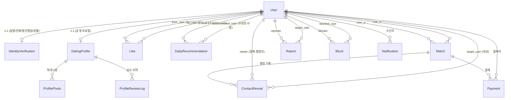

# ERD & 모델 레퍼런스

명세서 요약본 + 빠른 참조용. 자세한 정책은 원본 명세서 참고.

## 1. 한눈에 보는 관계도



## 2. 앱 ↔ 모델 매핑

| 앱 | 모델 |
|---|---|
| core | (추상) TimeStampedModel, SoftDeleteModel |
| accounts | User, IdentityVerification |
| profiles | DatingProfile, ProfilePhoto, ProfileReviewLog |
| matching | DailyRecommendation, Like, Match, ContactReveal |
| payments | Payment |
| reports | Report, Block |
| notifications | Notification |

## 3. 상태 머신

### User.status
```
REGISTERED → VERIFIED → PROFILE_PENDING → ACTIVE
PROFILE_PENDING → PROFILE_REJECTED → PROFILE_PENDING
ACTIVE → SUSPENDED → (ACTIVE | WITHDRAWN)
ACTIVE → WITHDRAWN
```

### DatingProfile.review_status
```
DRAFT → PENDING → APPROVED
PENDING → REJECTED → PENDING
APPROVED → PENDING   (승인 후 수정 시 재심사)
APPROVED → HIDDEN
```

### Match.status
```
ACTIVE → REVEALED | EXPIRED | BLOCKED | CANCELLED
```

### Payment.status
```
READY → PAID | FAILED | CANCELLED
PAID  → REFUNDED
```

## 4. 핵심 Unique 제약

| 모델 | 제약 |
|---|---|
| IdentityVerification | `user` unique (1:1) |
| DatingProfile | `user` unique (1:1) |
| Like | (`from_user`, `to_user`) unique |
| DailyRecommendation | (`user`, `recommended_user`, `date`) unique |
| Match | (`user_a`, `user_b`) unique — 항상 작은 id를 user_a로 |
| Block | (`blocker`, `blocked_user`) unique |
| ContactReveal | (`match`, `viewer`) unique |

## 5. 주요 인덱스

```
User.status
DatingProfile.review_status / gender / age
DailyRecommendation (user, date) / recommended_user
Like.from_user / Like.to_user
Match.user_a / user_b / status / expires_at
Payment.user / match / status
Report.status
Notification (user, is_read)
```

## 6. 공개 / 비공개 필드 (보안 핵심)

| 공개 (다른 사용자에게) | 비공개 (본인/관리자/ContactReveal에서만) |
|---|---|
| nickname, age, gender, mbti, bio, photos | real_name, phone_number, email, birth_date, ci, di |

> 전화번호는 **오직** `GET /contact-reveals/{id}/` (결제한 viewer 본인) 에서만 반환.

## 7. 핵심 비즈니스 규칙 요약

- **추천**: ACTIVE만 추천/피추천. 자기 자신·차단·기매칭·중복 제외. 성별 기준 단순 랜덤. 하루 4명.
- **하트**: ACTIVE만. 자기 자신/차단 대상/중복 불가. 무료. 상호 하트 → Match.
- **매칭**: 두 사용자당 1개. `expires_at = matched_at + 3일`. 만료 후 연락처 열람 불가.
- **연락처 열람**: Match 참여자만, ACTIVE & 미만료일 때만 결제. 매칭당 사용자별 1회. 결제자만 전화번호 열람. 열람 시점 번호를 snapshot 저장.
- **결제**: 5,000원, Mock. READY→(mock-complete)→PAID→ContactReveal 생성.
